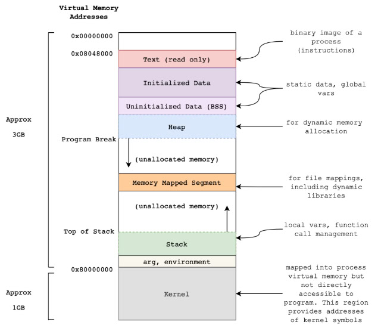
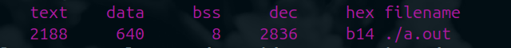
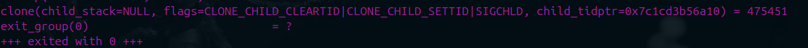
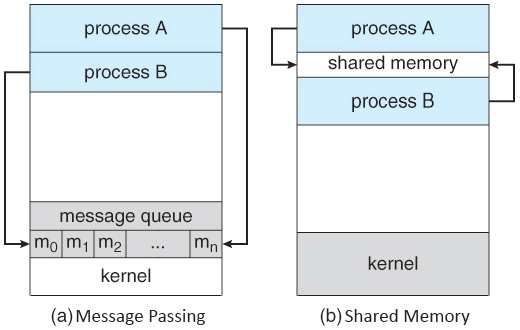

# ***Processes***

***Process*** a program in execution. Process execution progresses in sequential feshion (i.e. no parallel execution of instructions of a single process).

### ***Memory Layout of a Program***

>NOTE: you can use `size [binary]` to see mem layout




```c
#include <stdio.h>
#include <stdlib.h>

static char bss_segment;
static long long data_segment = 42;

int main(int argc, char **argv) {
    char *str = (char *)calloc(5, sizeof(char));
    int num = 0x0DDC0FFEE;

    printf("-------------------------------------0x00000000\n");
    printf("Data segment: %p\n", &data_segment);
    printf("BSS: %p\n", &bss_segment);
    printf("HEAP segment: %p\n", str);
    printf("STACK segment: %p\n", &num);
    printf("arg, environment segment: %p\n", argv);
    printf("-------------------------------------0x80000000\n");

    assert((long long *)&data_segment < (long long *)&bss_segment < (long long *)str < (long long *)&num < (long long *)argv);

    free(str);
    return 0;
}
```

Compiling and calling `size ./a.out` produces:



### ***Process State***

A CPU core can only execute one process at a time, but many processes compete for it. 
Process states help the operating system track what each process is doing and decide which process should get a core next.

- ***New***: The process is being created
- ***Ready***: The process is waiting to be assigned to a processor
- ***Running***: Instructions are being executed
- ***Waiiting***: The process is waiting for some event to occure
- ***Terminated***: The process has finished execution


### ***Process Control Block (PCB)***
Information associated with each process (process state, program counter, cpu registers, cpu scheduling information, memory management information, I/O status information, etc.).


### ***Process Scheduling***
Process scheduler selects among available processes for next execution on CPU core. Also, it maintains scheduling queues of processes.
- ***Ready queue*** - set of all processes residing in main memory, ready and waiting to execute.
- ***Wait queues*** - set of processes waiting for an event e.g., I/O.


### ***Context Switch***
When CPU switches to another process, the system must save the state of the old process and load the saved state for the new process. The ***Context*** of a process represented in the ***PCB***.


### ***Process Creation***

- `fork()` system call to create a new process by duplicating the current one.
- `exec()` replaces the current process image with a new program (loads a new program into that same process), (`execl()`, `execp()`, `execv()`, `execvp()`).
- `wait()` parent waits for child to finish.

### ***What's happenning when we are calling fork?***
```c
#include <stdio.h>
#include <sys/wait.h>
#include <unistd.h>

int main(int argc, char **argv) {
    
    printf("[parent process] - start (PID: %d)\n", getpid());
    pid_t pid = fork();
    int status;

    /* The parent gets the child PID, and the child PID gets 0. */

    if (pid < 0) {                              /* error occured */
        fprintf(stderr, "Fork failed!\n");
        return 1;
    } else if (pid == 0) {                      /* child process */
        printf("[child process] - start (CURRENT PID: %d, PARENT PID: %d)\n", getpid(), getppid());
        execlp("/bin/ls", "ls", NULL);
        return 0;
    } else {                                    /* parent process */
        pid_t cpid  = wait(&status);   /* parent will wait for the child to complete */
        printf("[child process] - complete, PID: %d, STATUS: %d\n", cpid, status);
        printf("[parent process] - completing... (PID: %d)\n", getpid());
    }
    

    return 0;
}
```

Process creation starts with `fork()`, it triggers a system call that creates a new process by duplicating the caller. Specifically it calls the `clone()` syscall to clone a procecss (creating a child process).



***What do we mean by "duplicating the caller"?***

After duplication, parent and child processes, both now have their own page tables, own PCB, registers, file descriptors (references), but same virtual addresses.

```cgi
Parent VA 0x4000 ─┐
                  ├──> Physical Frame #123
Child  VA 0x4000 ─┘   (shared, read-only)
```

Everything is shared initially.

***Copy-On-Write*** (COW)

Kernel marks these pages as `READ-ONLY + COW flag`, thus if neither writes, no copying ever happens. If one writes, page fault occurs, kernel copies that page and writer gets private copy.

***Child writes to heap page*** - kernel copies 4KB page, child gets new physical frame, parent still has old one

***Before***
```cgi
Parent heap ─┐
             ├── Physical Page A
Child heap  ─┘
```
***After***
```cgi
Parent heap ── Physical Page A
Child heap  ── Physical Page B (copy)
```

***Child Is Put In Ready Queue***

Scheduler marks child as `READY` and then inserts into `READY QUEUE`.

***Summary of process creation with `fork`***
1. User calls fork()
2. CPU traps into kernel
3. Kernel allocates PCB (task_struct)
4. Virtual memory duplicated (COW)
5. File descriptors copied
6. CPU context copied
7. Child inserted into ready queue
8. Scheduler runs parent & child

### ***Process Termination***

Process executes last statement and then terminates by calling `exit()`. Exit status is recorded by the kernel and retrieved later by the parent via `wait()`. Process' resources are deallocated by OS.
Parent may terminate the execution of children process by sending a signal via `kill()`.

- ***orphan process*** - a child whose parent terminates before it finishes.
- ***zombie process*** - a child process that has finished execution but whose parent has NOT called `wait()` yet.

### ***Processes Observation & Other Commands***
- ***Process***: `ps`, `pstree`, `top`, `ulimit`
- ***Binary***: `strace`, `objdump`, `valgrind`, `size`

### ***Interprocess Communication***

Processes within a system may be independent or cooperating.
Cooperating processes can affect or be affected by other processes and even share data.

Cooperating processes need ***inter process communication*** (IPC)



```c
/* WIP */
```

### ***Signals***
***Signals*** are used in UNIX systems to notify a process that a particular event hhas occured. 
A ***signal handler*** is used to process signals
1. Signal is generated by particular event.
2. Signal is delivered to a process.
3. Signal is handled by one of two signal handlers (***default*** and ***user-defined***).

Every signal has ***default handler*** defined by the kernel (user-defined signals can override default).

>NOTE: you may want to run `kill -l` to see available signals.

When a signal is sent to a process, it interrupts its normal execution, and either:
- Uses the default signal handler
- Or uses a process defined signal handler

Let's consider `kill(pid_t pid, int sig)` system call that sends a signal to a process.
```c
#include <signal.h>
#include <unistd.h>
#include <stdio.h>

int main(int argc, char **argv) {
    pid_t pid = fork();
    if (pid < 0) {
        fprintf(stderr, "fork failed");
    } else if (pid == 0) {
        for (int i = 0; i < 10; ++i) {
            sleep(3);
            printf("[child %d] iteration = %d\n", getpid(), i);
        }
    } else {
        printf("[parent %d] enter `1` to kill the child\n", getpid());
        int input;
        int serr = scanf("%d", &input);
        if (serr != 1) {
            fprintf(stderr, "scanf failed");
        }
        if (serr == 1) {
            kill(pid, SIGTERM);
        }
    }
    return 0;
}
```

Example with `signal()` that tells the kernel how your program wants to react when a specific signal arrives.
```c
#include <stdio.h>
#include <signal.h>
#include <unistd.h>

void sighandler(int sig) {
    printf("Received a signal: %d\n", sig);
}

int main(int argc, char **argv) {
    signal(SIGINT, sighandler);
    for(;;);
    return 0;
}
```

Good article about signals: [Understanding Signals in the C Language](https://medium.com/@razika28/signals-ad83f38f80b6)
