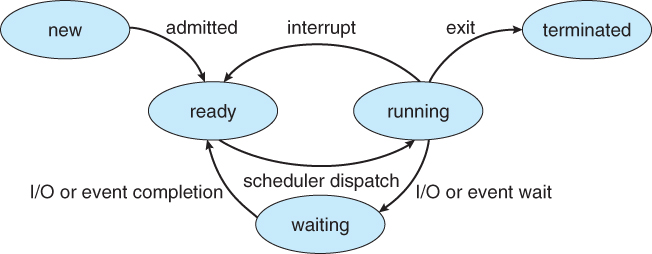

# ***Peocesses & Threads***

***Process*** a program in execution. Process execution progresses in sequential feshion (i.e. no parallel execution of instructions of a single process).

### ***Memory Layout of a Program***

>NOTE: you can use `size [binary]` to see mem layout


### ***Process State***
- ***New***: The process is being created
- ***Running***: Instructions are being executed
- ***Waiiting***: The process is waiting for some event to occure
- ***Ready***: The process is waiting to be assigned to a processor
- ***Terminated***: The process has finished execution




### ***Process Control Block (PCB)***
Information associated with each process (process state, program counter, cpu registers, cpu scheduling information, memory management information, I/O status information, etc.).


### ***Process Scheduling***
Process scheduler selects among available processes for next execution on CPU core. Also, it maintains scheduling queues of processes.
- ***Ready queue*** - set of all processes residing in main memory, ready and waiting to execute.
- ***Wait queues*** - set of processes waiting for an event e.g., I/O.


### ***Context Switch***
When CPU switches to another process, the system must save the state of the old process and load the saved state for the new process. The ***Context*** of a process represented in the ***PCB***.


Everything starts from ***systemd*** process (run `pstree`).

### ***Process Creation***

- `fork()` system call to create a new process by duplicating the current one.
- `exec()` replaces the current process image with a new program (loads a new program into that same process), (`execl()`, `execp()`, `execv()`, `execvp()`).
- `wait()` parent waits for child to finish.

### ***What's happenning when we are calling fork?***
```c
#include <stdio.h>
#include <sys/wait.h>
#include <unistd.h>

int main(int argc, char **argv) {
    
    printf("[parent process] - start (PID: %d)\n", getpid());
    pid_t pid = fork();
    int status;

    /* The parent gets the child PID, and the child PID gets 0. */

    if (pid < 0) {                              /* error occured */
        fprintf(stderr, "Fork failed!\n");
        return 1;
    } else if (pid == 0) {                      /* child process */
        printf("[child process] - start (CURRENT PID: %d, PARENT PID: %d)\n", getpid(), getppid());
        execlp("/bin/ls", "ls", NULL);
        return 0;
    } else {                                    /* parent process */
        pid_t cpid  = wait(&status);   /* parent will wait for the child to complete */
        printf("[child process] - complete, PID: %d, STATUS: %d\n", cpid, status);
        printf("[parent process] - completing... (PID: %d)\n", getpid());
    }
    

    return 0;
}
```

todo!();

### ***Process Termination***

Process executes last statement and then terminates by calling `exit()`. Exit status is recorded by the kernel and retrieved later by the parent via `wait()`. Process' resources are deallocated by OS.
Parent may terminate the execution of children process by sending a signal via `kill()`.

- ***orphan process*** - a child whose parent terminates before it finishes.
- ***zombie process*** - a child process that has finished execution but whose parent has NOT called `wait()` yet.

### ***Processes Observation & Other Commands***
- ***Process***: `ps`, `pstree`, `top`
- ***Binary***: `strace`, `objdump`, `valgrind` 

### ***Interprocess Communication***

Processes within a system may be independent or cooperating.
Cooperating processes can affect or be affected by other processes and even share data.

Cooperating processes need ***inter process communication*** (IPC)


