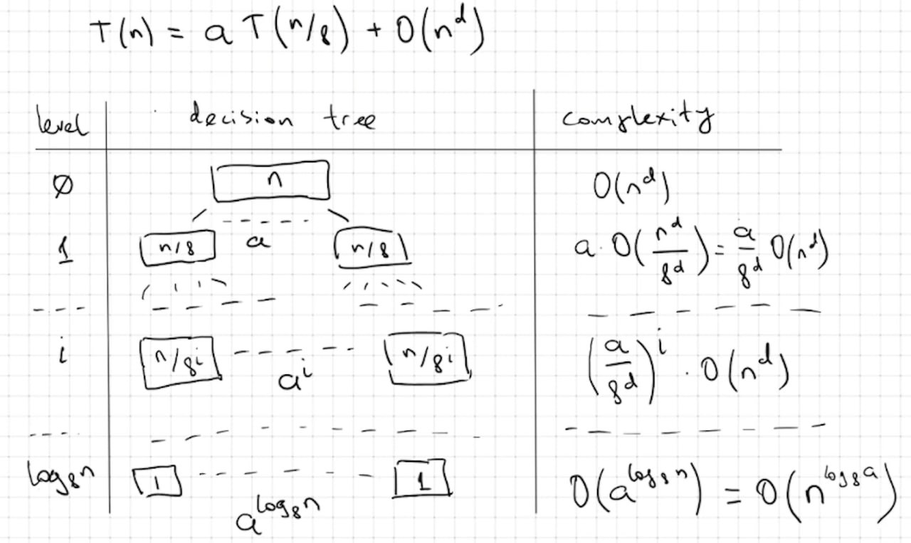
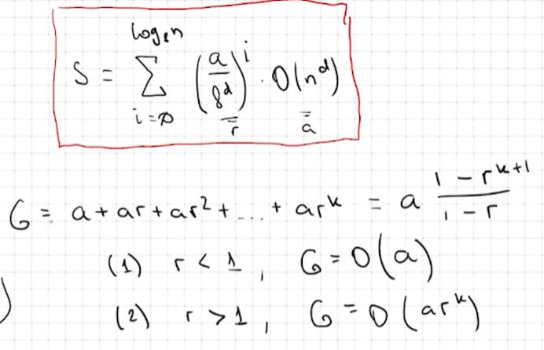
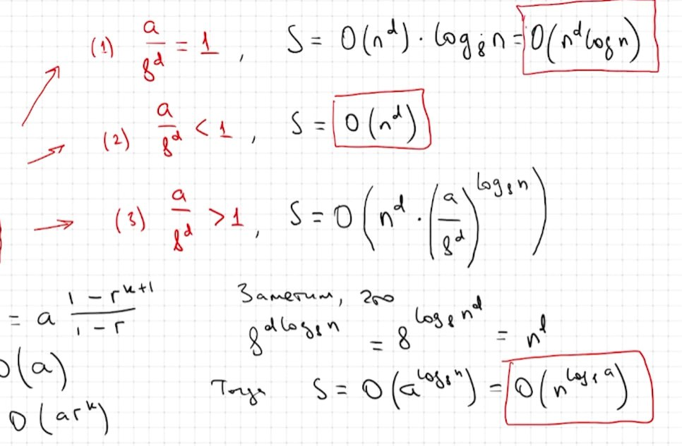

# C Programming Language (MIPT, 2023-2024)

In this directory, I'm storing my notes from the MIPT course on [practising the C programming language](https://youtube.com/playlist?list=PL3BR09unfgchRxdDws74aY4mlSk9eYGEs&si=a94ceeIaErfLd4sa).

### Seminars
- [seminar 3]() - mostly sorting algorithms, divide and conquer, master theorem.
- [seminar 4]() - data structures.
- [seminar 5]()
- [seminar 6]()

## Essential Concepts

### Master Theorem

This section covers essential algorithmic concepts such as asymptotic analysis, time complexity, and the Master Theorem for solving recurrence relations. These topics form the foundation for evaluating and comparing the efficiency of algorithms.

