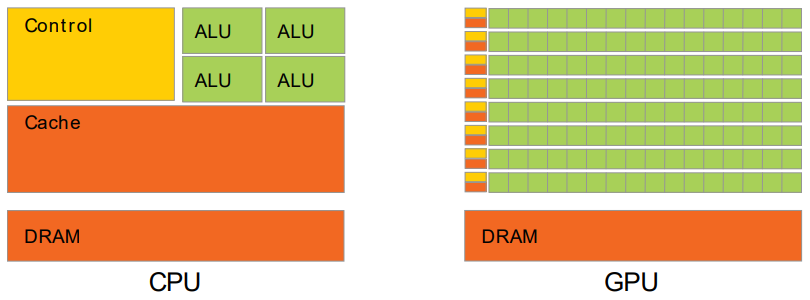
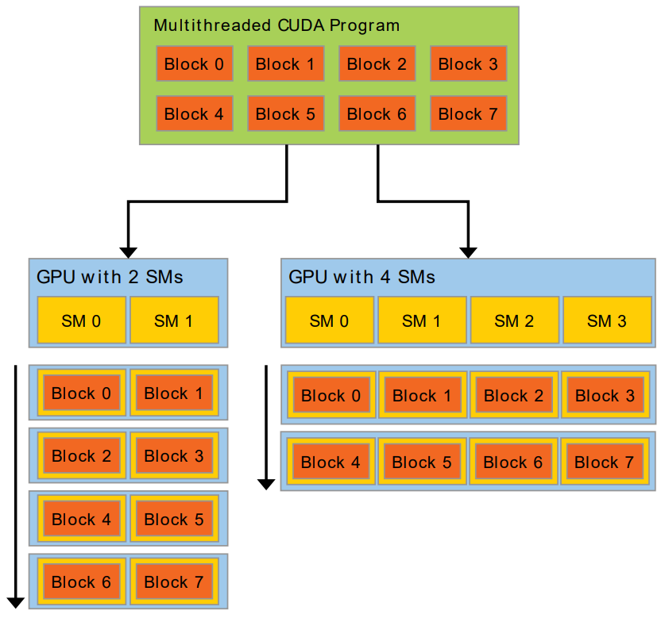

# Chapter 1. Introduction

The reason behind the discrepancy in floating-point capability between the CPU and the GPU is that the GPU is specialized for compute-intensive, highly parallel computation - exactly what graphics rendering is about - and therefore designed such that more transistors are devoted to data processing rather than data caching and flow control, as schematically illustrated by the figure below.

More specifically, the GPU is especially well-suited to address problems that can be expressed as data-parallel computations - the same program is executed on many data elements in parallel - with high arithmetic intensity - the ratio of arithmetic operations to memory operations. Because the same program is executed for each data element, there is a lower requirement for sophisticated flow control, and because it is executed on many data elements and has high arithmetic intensity, the memory access latency can be hidden with calculations instead of big data caches.

CUDA uses nested parallelism:

- Blocks handle coarse-grained, independent sub-problems.
- Threads within each block work cooperatively on finer-grained parts.
- Blocks can run on any available GPU multiprocessor, in any order or concurrently.
- Therefore, the same CUDA program can automatically scale across GPUs with different numbers of multiprocessors.
- The programmer focuses on the problem decomposition, while the runtime handles mapping blocks to the available hardware.

