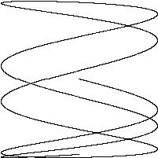

# *Animated GIF*

Used Go's standard image packages to create a sequence of bit-mapped images and then encode the sequence as a GIF animation.

## *Build*

```sh
go build animated_gifs.go
./animated_gifs > out.gif
open out.gif
```

## *Example*


